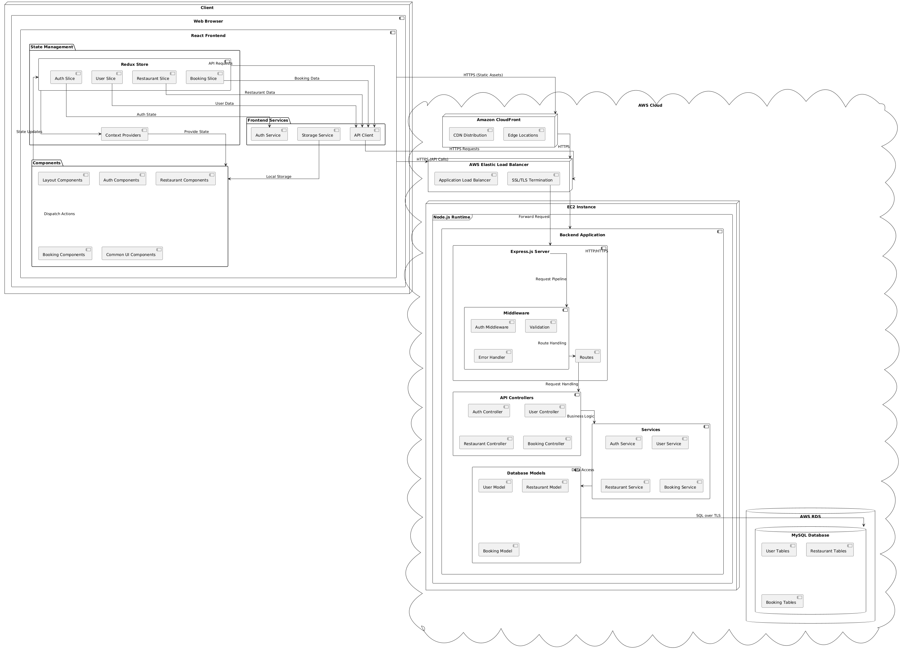
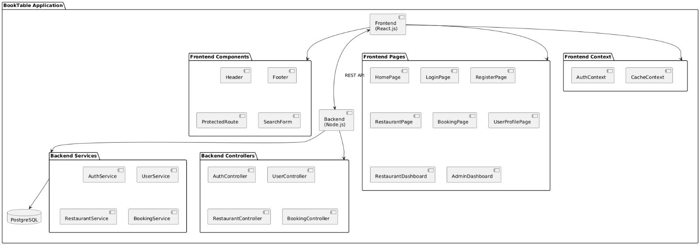
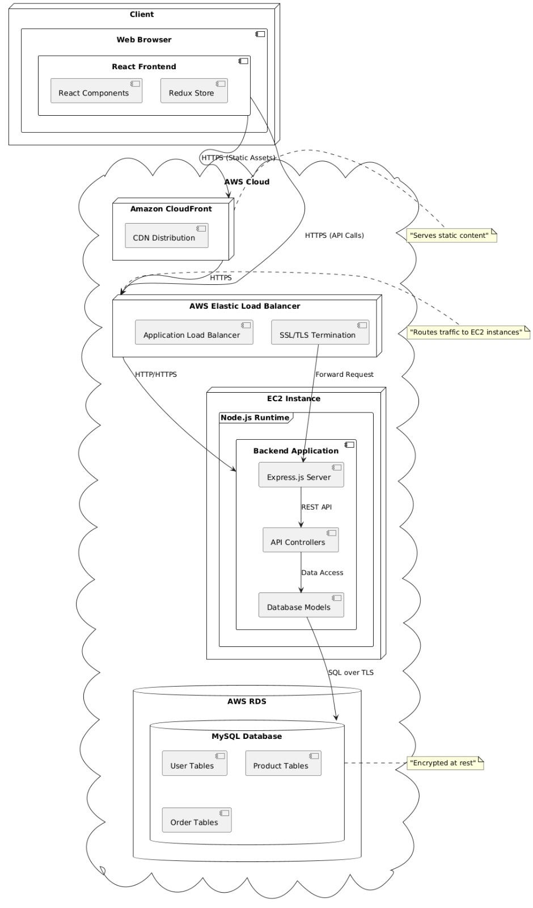

# Team Project - The Debuggers

## Team Members

| Name | Student ID |
|------|------------|
| [Nikhil Dupally] | [018325736] |
| [Rithwik Reddy Eedula] | [018292664] |
| [Vijaya Sharavan Reddy] | [018321342] |
| [Venkata Gowtham Jalam] | [018315791] |

## Project Architecture

### Technology Stack

#### Frontend
- React.js with TypeScript
- Redux for state management
- Material-UI/Bootstrap for styling

#### Backend
- Node.js with Express
- TypeScript
- MySQL Database
- AWS Services (EC2, RDS, ELB, CloudFront)

### Architecture Diagrams

#### System Architecture


#### Component Diagram


#### Deployment Architecture



## Design Decisions

### Architecture Patterns
- **Microservices Architecture**: Separating frontend and backend for better scalability
- **MVC Pattern**: Clear separation of concerns in the backend
- **Redux Pattern**: Centralized state management in frontend

### Security Measures
- SSL/TLS encryption for all communications
- Database encryption at rest
- Load balancer SSL termination
- Secure session management

### Database Design
- Relational database (MySQL) for data integrity
- Proper indexing for performance
- Normalized schema design

## Feature Set

### User Management
- User registration and authentication
- Profile management
- Role-based access control

### Product Management
- Product listing and search
- Product categories
- Product details and images

### Order Management
- Shopping cart functionality
- Order processing
- Order history

### Additional Features
- Real-time inventory updates
- Search functionality
- Responsive design
- Performance optimization

## Getting Started

### Prerequisites
- Node.js (v14 or higher)
- MySQL
- AWS Account (for deployment)

### Local Development
1. Clone the repository
2. Install dependencies:
   ```bash
   # Frontend
   cd frontend
   npm install

   # Backend
   cd backend
   npm install
   ```
3. Set up environment variables
4. Start the development servers:
   ```bash
   # Frontend
   npm start

   # Backend
   npm run dev
   ```

## Deployment

The application is deployed on AWS with the following components:
- Frontend: Served through CloudFront CDN
- Backend: Running on EC2 instances
- Database: AWS RDS MySQL instance
- Load Balancing: AWS Elastic Load Balancer

## Contributing

Please follow these steps for contributing:
1. Create a feature branch
2. Commit your changes
3. Create a pull request
4. Get review and approval

